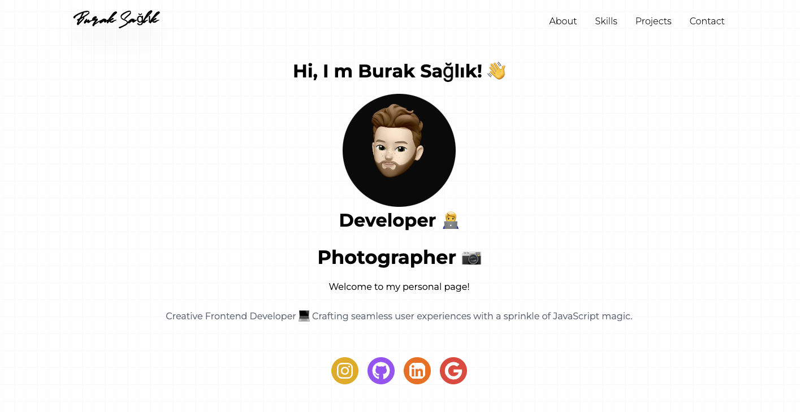

# Personal Portfolio Project 🌐

This is a personal portfolio project built with the following technologies:

- **[Next.js 15](https://nextjs.org/)**: The React Framework for Production.
- **[React 18](https://reactjs.org/)**: A JavaScript library for building user interfaces.
- **[Framer Motion 11](https://www.framer.com/motion/)**: An animation library for React.
- **[Tailwind CSS](https://tailwindcss.com/)**: A utility-first CSS framework.

## 🚀 Features

- **Interactive Design**: Smooth animations with Framer Motion.
- **Responsive Layout**: Fully optimized for mobile, tablet, and desktop screens.
- **Modern Tech Stack**: Built with Next.js and Tailwind CSS for performance and scalability.

## 📸 Screenshot



## 🛠 Installation and Setup

To get started with this project, follow these steps:

1. Clone the repository:

   ```bash
   git clone https://github.com/sglkbrk/burak-portfolio-website.git
   ```

2. Navigate to the project directory:

   ```bash
   cd burak-portfolio-website
   ```

3. Install the dependencies:

   ```bash
   npm install
   ```

4. Start the development server:

   ```bash
   npm run dev
   ```

5. Open your browser and visit:
   ```bash
   http://localhost:3000
   ```

## 🏗 Build for Production

To build the project for production, run:
`bash
    npm run build
    `

Then start the production server with:
`bash
    npm start
    `

## 🌍 Live Demo

Check out the live version of the project here:  
[https://buraksaglik.com/](https://buraksaglik.com/)
